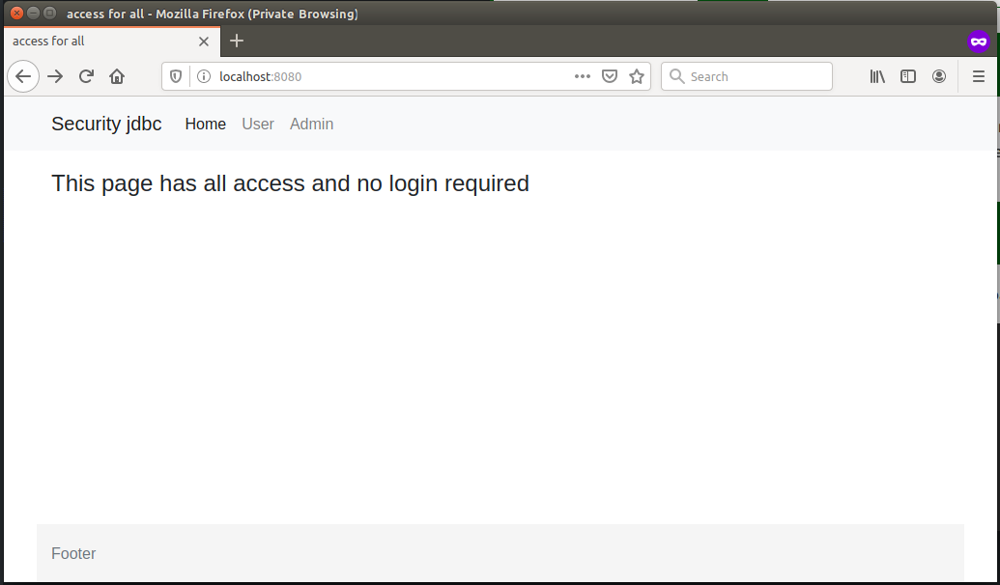
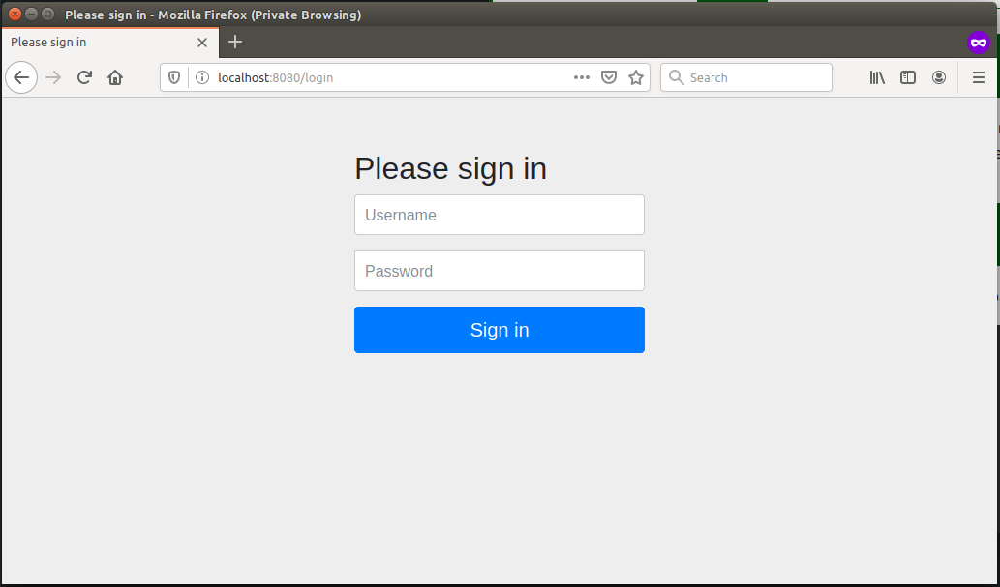
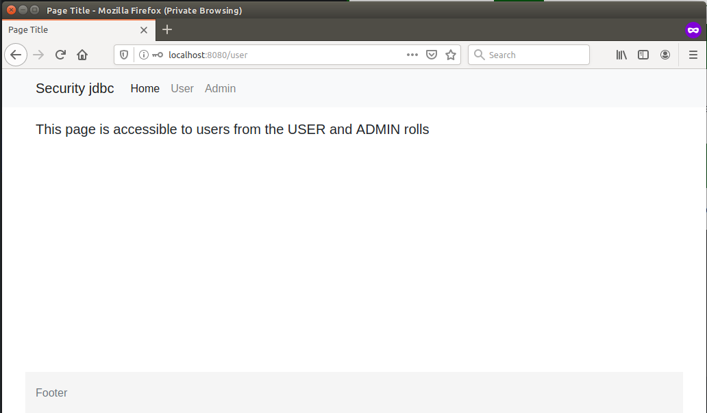
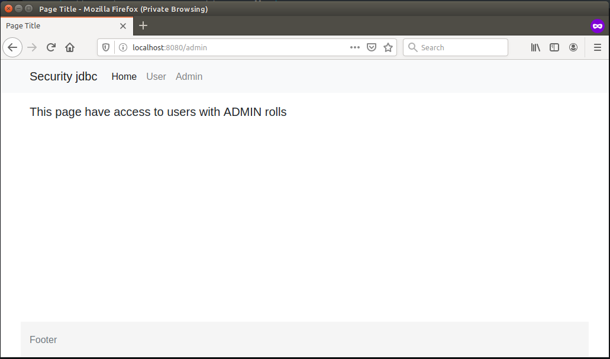

# Spring security jdbc
### http://localhost:8080/ All have access to the homepage

### http://localhost:8080/login

### http://localhost:8080/user Everyone with the ADMIN and USER roles has access

### http://localhost:8080/admin Only the ADMIN role can access this page
